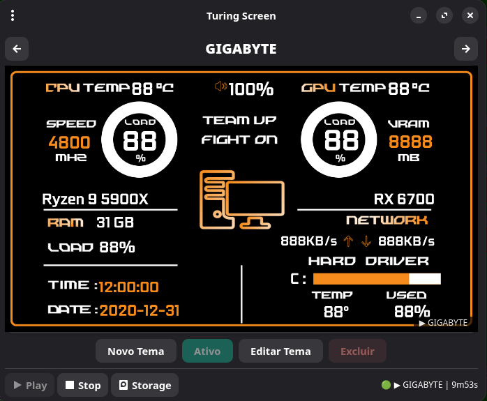
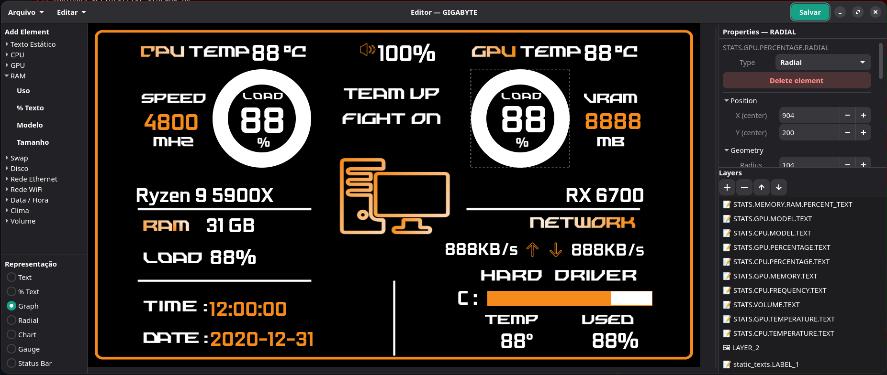
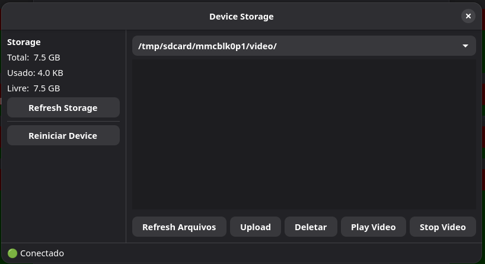
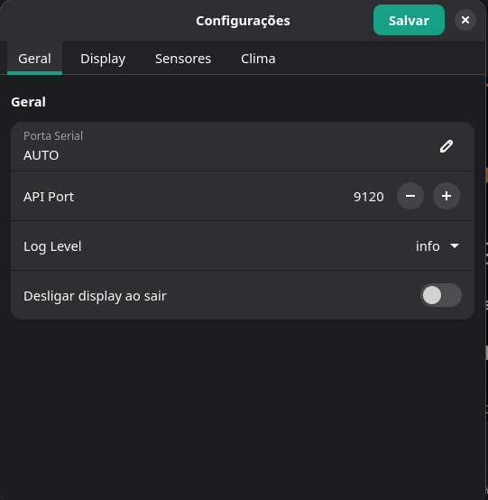

# Turing Smart Screen — Linux Driver

Open-source Linux driver and theme editor for **Turing Smart Screen** USB displays.

The project ships two packages:

| Package | Description |
|---|---|
| `turing-screen` | Go daemon — renders themes to the device via USB, exposes a WebSocket API |
| `turing-interface` | GTK4/Python theme editor — drag-and-drop layout editor, device manager, storage browser |

---

## Supported Hardware

### TURZX (USB direct — recommended)

These devices appear as a raw USB device (Vendor ID `0x1CBE`). The driver communicates directly via `libusb`. **No serial port required, no root needed** — add your user to the `smart-screen` group after install.

| Product ID | Native resolution | Notes |
|---|---|---|
| `0x0028` | 480 × 480 | Square panel |
| `0x0046` | 320 × 960 | Tall narrow panel |
| `0x0050` | 720 × 1280 | Turing Smart Screen 5.2" |
| `0x0080` | 800 × 1280 | |
| `0x0088` | 480 × 1920 | |
| `0x0092` | 462 × 1920 | |
| `0x0123` | 720 × 1920 | |

Frames are always sent in portrait orientation; the driver rotates per the `ORIENTATION` declared in `theme.yaml`.

### Rev-C (USB CDC ACM — serial)

Older devices that enumerate as a virtual serial port (`/dev/ttyACM*`). Detected automatically by USB serial number `20080411`. The 7" variant (serial `USB7INCH`) is detected with an automatic 20-second wake sequence.

Default resolution: **800 × 480** (landscape 3.5") — set `width`/`height` in `conf/config.yaml` to match your screen.

---

## Architecture

```
┌────────────────────────────────────────────────────────────┐
│  turing-screen (Go daemon)                                 │
│                                                            │
│  config.yaml ──► Theme YAML ──► Compositor ──► USB device │
│                                      ▲                     │
│  Sensor goroutines ─────────────────┘                      │
│  (CPU / GPU / RAM / Disk / Net / Vol / Weather / Date)     │
│                                                            │
│  WebSocket API (ws://localhost:9120/ws)                    │
└────────────────────┬───────────────────────────────────────┘
                     │ WebSocket
┌────────────────────▼───────────────────────────────────────┐
│  turing-interface (GTK4 / Python)                          │
│                                                            │
│  Home ──► Theme editor (drag-and-drop canvas)             │
│       ──► Storage browser (upload / play / delete)        │
│       ──► Settings (sensors, network, weather, display)   │
└────────────────────────────────────────────────────────────┘
```

The daemon runs as a **systemd service** and communicates with the display entirely over USB. The GTK4 editor is optional — themes can be written by hand and reloaded without restarting the daemon.

---

## Screenshots

| | |
|---|---|
|  |  |
| **Home** — select and activate themes, preview, connect to device | **Theme Editor** — drag-and-drop canvas, properties panel, layers |
|  |  |
| **Storage** — browse device filesystem, upload/download, play videos | **Settings** — sensors, network interfaces, weather, display options |

---

## Installation

### Arch Linux (recommended — via PKGBUILD)

```bash
git clone https://github.com/alexwbaule/turing-screen.git
cd turing-screen
makepkg -si
```

This builds and installs both `turing-screen` and `turing-interface`. The version is auto-generated from `git describe` (e.g. `1.3.4.r2.gabcdef1`).

After install, enable the daemon:

```bash
sudo systemctl enable --now smart-screen-go
sudo systemctl enable sleep@smart-screen-go   # suspend/resume hook
```

The installer adds your user to the `smart-screen` group automatically. Re-login (or `newgrp smart-screen`) for USB permissions to take effect.

### Manual install (any distro)

**Requirements:** Go 1.21+, GCC, `libusb-1.0`

```bash
git clone https://github.com/alexwbaule/turing-screen.git
cd turing-screen
sudo make install
```

`make install` builds the daemon, copies resources to `/opt/smart-screen/`, installs systemd units, creates the `smart-screen` group, and adds `$SUDO_USER` to it.

**Python editor dependencies:**

```bash
# Arch Linux:
sudo pacman -S python-gobject gtk4 libadwaita python-cairo \
               python-websockets python-yaml python-pillow

# pip (other distros):
pip install pygobject pycairo websockets pyyaml pillow
```

---

## Quick Start (without systemd)

```bash
cd /opt/smart-screen          # or your source checkout
./bin/turing-screen           # daemon — reads conf/config.yaml

# In a second terminal, open the editor:
turing-interface              # or: python3 interface/main.py
```

---

## Configuration

Edit `/opt/smart-screen/conf/config.yaml`:

```yaml
device:
  port: AUTO          # AUTO detects by USB serial number; or /dev/ttyACM0
  theme: HAKAI        # folder name under res/themes/
  api_port: 9120      # WebSocket API port
  log: info           # debug | info | warn | error

  display:
    width: 1280       # logical canvas width (pixels)
    height: 720       # logical canvas height
    brightness: 25    # 0–100

  sensors:
    cpu:
      interval: 1s
      temperature_sensor: auto   # auto | path under /sys/class/hwmon

    gpu:
      interval: 1s
      provider: auto   # auto | amd | nvidia | none

    memory:
      interval: 5s

    disk:
      interval: 10s
      temperature_sensor: auto

    network:
      interval: 1s
      eth: enp3s0      # wired interface name
      wlo: wlp4s0      # WiFi interface name

    weather:
      enabled: true
      city: "Sao Paulo,BR"
      interval: 30m

  turn_off_on_exit: false
```

---

## Sensors

| Category | Metrics |
|---|---|
| **CPU** | Usage %, temperature, frequency, fan speed, power, voltage, load average (1 / 5 / 15 min), model name |
| **GPU** | Usage %, VRAM usage, temperature, frequency, power, voltage, fan speed, model name |
| **RAM** | Usage %, swap %, total size |
| **Disk** | Used %, free %, temperature |
| **Network** | Upload speed, download speed, total uploaded, total downloaded (Ethernet + WiFi separately) |
| **Date / Time** | Current time and date (configurable format) |
| **Weather** | Temperature (°C), condition string, wind speed |
| **Volume** | System audio volume (PulseAudio) |

GPU detection supports **AMD** (via `sysfs`/`drm`) and **NVIDIA** (via `nvidia-smi`). Set `provider: none` to disable.

---

## Themes

Themes live in `res/themes/<name>/`. Each folder contains:

```
res/themes/HAKAI/
├── theme.yaml        ← layout and sensor bindings
├── assets/
│   ├── image_1.png   ← background and overlay images
│   └── image_3.png
└── (fonts referenced from res/fonts/)
```

### theme.yaml structure

```yaml
display:
  SIZE: 5"
  ORIENTATION: landscape   # landscape | portrait
  WIDTH: 1280
  HEIGHT: 720

# Static background layers — rendered once, stacked by INDEX
static_images:
  BACKGROUND:
    PATH: assets/image_1.png
    X: 0
    Y: 0
    WIDTH: 1280
    HEIGHT: 720
  LAYER_2:
    PATH: assets/image_3.png
    X: 0
    Y: 0
    WIDTH: 1280
    HEIGHT: 720
    INDEX: 1              # Z-order: BACKGROUND is 0, overlays start at 1

# Static text labels replaced at startup with real hardware values
static_texts:
  CPU_MODEL:
    TEXT: "{{CPU_MODEL}}"   # → "AMD Ryzen 9 5900X"
    SHOW: true
    X: 100
    Y: 50
    FONT: jetbrains-mono/JetBrainsMono-Bold.ttf
    FONT_SIZE: 24
    FONT_COLOR: 255, 255, 255

# Live sensor widgets — updated every INTERVAL seconds
STATS:
  CPU:
    PERCENTAGE:
      INTERVAL: 1
      GRAPH:                    # horizontal fill bar
        SHOW: true
        INDEX: 2
        X: 50
        Y: 100
        WIDTH: 200
        HEIGHT: 12
        MIN_VALUE: 0
        MAX_VALUE: 100
        BAR_COLOR: 0, 120, 255
        BAR_OUTLINE: false
      TEXT:                     # numeric label
        SHOW: true
        INDEX: 3
        X: 260
        Y: 94
        FONT: jetbrains-mono/JetBrainsMono-Bold.ttf
        FONT_SIZE: 28
        FONT_COLOR: 255, 255, 255
        SHOW_UNIT: true
        PLACEHOLDER: 88%
    TEMPERATURE:
      INTERVAL: 1
      RADIAL:                   # arc/circular gauge
        SHOW: true
        INDEX: 4
        X: 400
        Y: 80
        RADIUS: 60
        ANGLE_START: 150
        ANGLE_END: 390
        BAR_COLOR: 255, 80, 0
        MIN_VALUE: 0
        MAX_VALUE: 100
        SHOW_TEXT: true

  GPU:
    PERCENTAGE:
      INTERVAL: 1
      PERCENT_TEXT:             # "XX%" label without graph
        SHOW: true
        INDEX: 5
        X: 700
        Y: 100
        FONT: jetbrains-mono/JetBrainsMono-Bold.ttf
        FONT_SIZE: 48
        FONT_COLOR: 100, 255, 100
        PLACEHOLDER: "88%"

  MEMORY:
    INTERVAL: 5
    RAM:
      GRAPH:
        SHOW: true
        INDEX: 6
        X: 50
        Y: 300
        WIDTH: 200
        HEIGHT: 12
        BAR_COLOR: 180, 0, 255
      SIZE:                     # total RAM from hwinfo ("32 GB")
        TEXT:
          SHOW: true
          INDEX: 7
          X: 260
          Y: 294
          FONT: jetbrains-mono/JetBrainsMono-Bold.ttf
          FONT_SIZE: 18
          FONT_COLOR: 200, 200, 200
          PLACEHOLDER: 32 GB
    SWAP:
      PERCENT_TEXT:
        SHOW: true
        INDEX: 8
        X: 50
        Y: 340

  DISK:
    INTERVAL: 10
    USED:
      GRAPH:
        SHOW: true
        INDEX: 9
        X: 50
        Y: 400
        WIDTH: 200
        HEIGHT: 12
        BAR_COLOR: 255, 200, 0
    TEMPERATURE:
      TEXT:
        SHOW: true
        INDEX: 10
        X: 260
        Y: 394

  NET:
    INTERVAL: 1
    ETH:
      UPLOAD:
        TEXT:
          SHOW: true
          INDEX: 11
          X: 50
          Y: 500
      DOWNLOAD:
        TEXT:
          SHOW: true
          INDEX: 12
          X: 200
          Y: 500

  DATE:
    INTERVAL: 1
    HOUR:
      TEXT:
        SHOW: true
        INDEX: 13
        X: 1100
        Y: 650
        FORMAT: short      # short (HH:MM) | medium | long
    DAY:
      TEXT:
        SHOW: true
        INDEX: 14
        X: 1000
        Y: 680
        FORMAT: medium

  WEATHER:
    TEMPERATURE:
      TEXT:
        SHOW: true
        INDEX: 15
        X: 900
        Y: 50

  VOLUME:
    GRAPH:
      SHOW: true
      INDEX: 16
      X: 50
      Y: 580
      WIDTH: 100
      HEIGHT: 10
```

### Widget types

| Widget | YAML key | Description |
|---|---|---|
| Text | `TEXT` | Numeric or string label with custom font |
| Percent text | `PERCENT_TEXT` | Label formatted as `XX%` |
| Graph | `GRAPH` | Horizontal fill bar |
| Radial | `RADIAL` | Arc/circular gauge |
| Gauge | `GAUGE` | Vertical or horizontal gauge |
| Status bar | `STATUS_BAR` | Segmented status bar |
| Chart | `CHART` | Line/area chart with rolling history |

### Static text placeholders

Tokens in `static_texts.TEXT` fields are replaced at daemon startup with real hardware values:

| Token | Example value |
|---|---|
| `{{CPU_MODEL}}` | `AMD Ryzen 9 5900X` |
| `{{GPU_MODEL}}` | `Radeon RX 7800 XT` |
| `{{MEM_TOTAL}}` | `32 GB` |
| `{{DISK_MODEL}}` | `Samsung SSD 980 PRO` |
| `{{HOSTNAME}}` | `my-pc` |

### Included themes

49 themes ship out of the box, including: HAKAI, NZXT (B / C / BLUR / dynamic / color), ROG, ROG2, ROG Starry Sky, ASUKA, MSI, RAZER, GIGABYTE, VIPER, EVANGELION-01, Dragon Ball, Cyberpunk 2077, Genshin Impact, Gundam, Pikachu, bilibili 2233, Red Dead Redemption 2, and more.

---

## Theme Editor (GTK4)

Launch with `turing-interface` or `python3 interface/main.py` (from the project root or `/opt/smart-screen`).

The editor connects to the running daemon via WebSocket (`ws://localhost:9120/ws`) to receive live hardware info and send preview frames to the display.

### Home screen


- Lists all themes in `res/themes/` with a thumbnail preview
- **Activate** — tells the daemon to switch to this theme immediately (hot-swap, no restart)
- **Edit** — opens the theme in the canvas editor
- **Delete** — removes the theme folder from disk
- Footer toolbar: **Play / Stop** video playback, **Storage** browser
- Hamburger menu: **Settings**, **Configurações do dispositivo** (TURZX device settings), **About**, **Quit**

### Theme editor canvas


- **Left panel — Add Element**: accordion grouped by sensor category. Click a sensor to place a new widget. The **Representation** picker below the accordion selects the widget type (Text, % Text, Graph, Radial, Chart, Gauge, Status Bar).
- **Center — Canvas**: drag and resize elements freely. The selected element is highlighted. Background layers are shown non-interactively for visual reference.
- **Right panel — Properties**: edit X, Y, size, font path, font size, color, SHOW, INDEX, and type-specific fields (bar color, radius, angle, etc.). Changes save on blur.
- **Right panel — Layers**: full Z-ordered list of every element. Click to select, drag to reorder (changes the `INDEX`).
- **File menu**: New theme, Open, Save (`Ctrl+S`), Save As.
- **Edit menu**: Undo, Redo, Delete selected element.

Sensor categories available in the Add Element panel:

| Category | Available sensors |
|---|---|
| Texto Estático | Free label, CPU Model, GPU Model, Total RAM, Disk Model, Hostname |
| CPU | Model text, Usage %, Temperature, Frequency, Fan, Power, Voltage, Load 1 / 5 / 15 min |
| GPU | Model text, Usage %, VRAM %, Temperature, Power, Frequency, Voltage, Fan |
| RAM | Usage %, % Text, Model, Size (total) |
| Swap | Usage %, % Text |
| Disco | Used %, Free %, Temperature |
| Rede Ethernet | Upload speed, Download speed, Total uploaded, Total downloaded |
| Rede WiFi | Upload speed, Download speed, Total uploaded, Total downloaded |
| Data / Hora | Time, Date |
| Clima | Temperature, Condition string |
| Volume | Audio volume |

### Storage browser


Browses the device's internal storage over WebSocket. Directory layout by device type:

| Device | Directories |
|---|---|
| TURZX | `/tmp/sdcard/mmcblk0p1/video/`, `/tmp/sdcard/mmcblk0p1/img/` |
| Rev-C | `/root/video/`, `/root/image/`, `/root/font/`, `/root/` |

Actions: **Upload** from local disk, **Download** to local disk, **Delete** from device, **Play** video on the display, **Stop** playback. Storage totals (capacity / used / free) shown at top.

### Settings


Reads and writes `conf/config.yaml` directly via the GUI. Sections:

- **Device**: serial port (`AUTO` or `/dev/ttyACMx`), API port, log level
- **Display**: brightness (0–100)
- **CPU**: poll interval, temperature sensor path
- **GPU**: poll interval, provider (`auto` / `amd` / `nvidia` / `none`)
- **Memory**: poll interval
- **Disk**: poll interval, temperature sensor path
- **Network**: poll interval, Ethernet interface name, WiFi interface name
- **Weather**: enable/disable, city (`"City,Country"` format, e.g. `"Sao Paulo,BR"`), update interval

Changes take effect on the next daemon restart (or theme reload for sensor settings).

---

## Importing `.turtheme` files

The `FromApp/` directory contains a Python converter that transforms themes exported from the official Windows app into the project's YAML format.

```bash
cd FromApp

# List extracted themes available to convert
python3 convert_turtheme.py --list

# Convert a single theme by name
python3 convert_turtheme.py --theme NZXT_color

# Convert all themes at once
python3 convert_turtheme.py --all
```

The converter maps: background/overlay images (with `INDEX` z-ordering), all sensor widget types (graph, radial, text, percent text), Windows font names to bundled fonts, and optionally auto-translates Chinese labels to Portuguese via Google Translate (requires `deep_translator`).

---

## WebSocket API

The daemon exposes a WebSocket server at `ws://localhost:9120/ws`. All messages are JSON with the shape `{"id": "...", "action": "...", "payload": {...}}`.

Key actions:

| Action | Direction | Description |
|---|---|---|
| `event.hwinfo` | daemon → client | Hardware info: CPU model, GPU model, RAM size, hostname |
| `event.status` | daemon → client | Mode, theme name, uptime, device type (500 ms cadence) |
| `event.sensors` | daemon → client | Live sensor values snapshot (500 ms cadence) |
| `hwinfo.get` | client → daemon | Request fresh hardware info |
| `status.get` | client → daemon | Request current status |
| `theme.list` | client → daemon | List available themes |
| `theme.apply` | client → daemon | Switch active theme (hot-swap) |
| `mode.editor` | client → daemon | Stop sensors, free USB for preview |
| `mode.normal` | client → daemon | Resume sensors |
| `preview.frame` | client → daemon | Send raw PNG frame to display (editor mode) |
| `device.brightness` | client → daemon | Set display brightness (0–100) |
| `device.settings` | client → daemon | Save brightness/startup/rotation/sleep to device flash |
| `device.restart` | client → daemon | Wake/restart the display |
| `device.turnoff` | client → daemon | Turn off the display |
| `storage.list` | client → daemon | List files in a device directory |
| `storage.upload` | client → daemon | Upload a file to the device (base64 payload) |
| `storage.delete` | client → daemon | Delete a file from the device |
| `video.play` | client → daemon | Start video playback on device |
| `video.stop` | client → daemon | Stop video playback |

Full protocol details: [PROTOCOL.md](PROTOCOL.md).

---

## Systemd Services

| Service | Description |
|---|---|
| `smart-screen-go.service` | Main daemon — auto-restarts on crash |
| `sleep@smart-screen-go.service` | Stops daemon on system suspend, restarts on resume |

```bash
# Enable on boot
sudo systemctl enable --now smart-screen-go
sudo systemctl enable sleep@smart-screen-go

# Check status / follow logs
sudo systemctl status smart-screen-go
journalctl -u smart-screen-go -f
```

---

## Building from source

```bash
git clone https://github.com/alexwbaule/turing-screen.git
cd turing-screen

# Daemon only
make build              # → bin/turing-screen

# Full install (daemon + resources + systemd units + smart-screen group)
sudo make install
```

Build requirements: Go 1.21+, GCC, `libusb-1.0-dev` (`libusb` on Arch).

---

## License

See [LICENSE](LICENSE).
